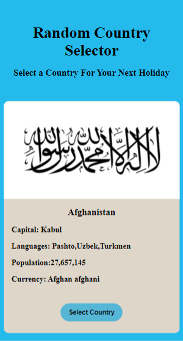
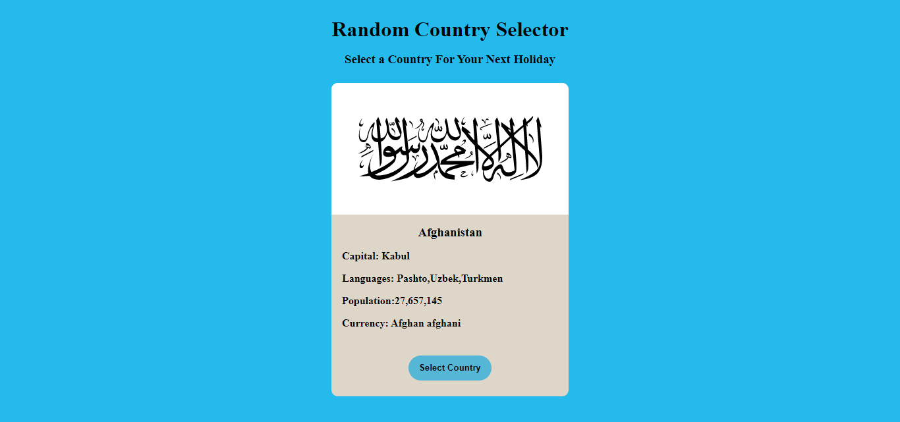

# 30 days of React. Day 04

## Table of contents

- [Overview](#overview)
  - [The challenge](#the-challenge)
  - [Screenshot](#screenshot)
  - [Links](#links)
- [My process](#my-process)
  - [Built with](#built-with)
  - [What I learned](#what-i-learned)
- [Author](#author)


## Overview

### The challenge
- Use react state to develop a random country Selector that selects your  holiday destination
### Screenshot





### Links

- Solution URL: (https://github.com/ibimina/travel-destination)
- Live Site URL:(https://ibimina.github.io/travel-destination/)

## My process
- import react from React,Component
- created a function that generate a random number used to change the state of data
- Created a Header,Main,Button component
- import css to be used for the project

Functions used to generate random country details
```js
changeCountry =()=>{
 let countryLength = data.length - 1;
let indexNo = (Math.random() * countryLength).toFixed(0);
let randoCount = data[indexNo];

this.setState({ data: randoCount });

}
```


### Built with

- JSX
- CSS custom properties
- Flexbox
- Mobile-first workflow


### What I learned

- I learnt how to change the array index using setState

## Author

- Ibimina Hart
- Frontendmentor -(https://www.frontendmentor.io/ibimina)
- Twitter -(https://www.twitter.com/ibiminaaH)